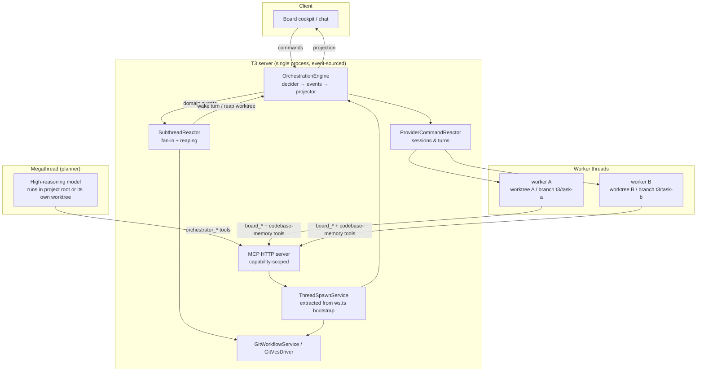
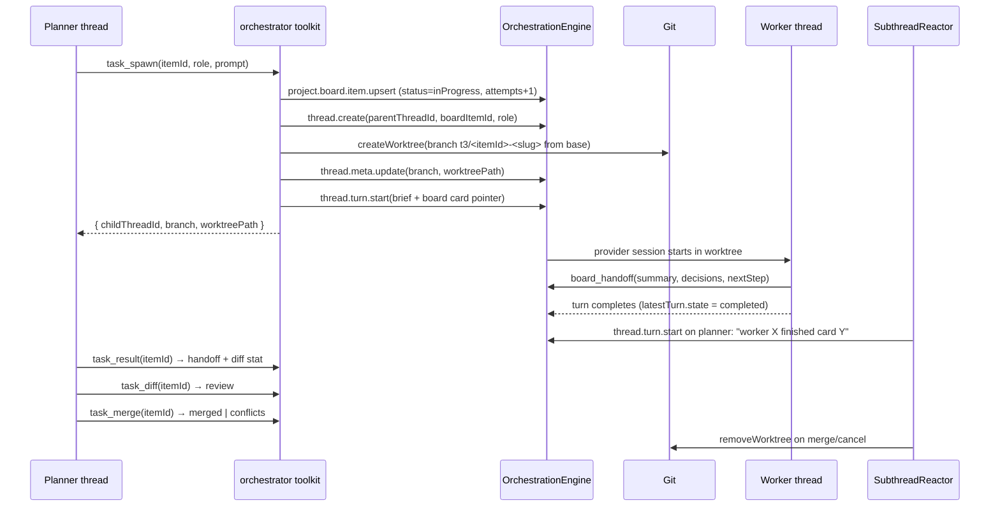

# Megathread orchestration — design

Hierarchical multi-agent execution on top of the existing project board, threads,
and git worktrees. One planner thread ("megathread") decomposes work into board
cards and spawns worker threads that execute each card in an isolated worktree
with a cheaper model; the planner reviews diffs and merges them back.

Design rule for the whole feature: **no new runtime.** Every moving part already
exists in this repo — event-sourced orchestration, threads with
`branch`/`worktreePath`, per-thread `modelSelection`, git worktree provisioning,
the board MCP toolkit, capability-scoped MCP sessions. The work is wiring, plus
one reactor, one git operation, and one toolkit.

## 1. Existing parts this builds on

| Need                                   | Already in repo                                                                                                                                    |
| -------------------------------------- | -------------------------------------------------------------------------------------------------------------------------------------------------- |
| Task store                             | `ProjectBoardItem` on the `project` aggregate (`packages/contracts/src/orchestration.ts:319`), projected to `projection_projects.board_items_json` |
| Task tools for agents                  | `apps/server/src/mcp/toolkits/board/` (`board_upsert`, `board_handoff`, `board_set_status`, …)                                                     |
| Thread ↔ worktree                      | `OrchestrationThread.branch` / `.worktreePath` (`orchestration.ts:536-537`)                                                                        |
| Spawn a thread + worktree + first turn | `dispatchBootstrapTurnStart` in `apps/server/src/ws.ts:759` (`thread.create` → `createWorktree` → setup script → `thread.turn.start`)              |
| Worktree git ops                       | `GitWorkflowService.createWorktree` / `removeWorktree`, `GitVcsDriverCore.ts:2741`                                                                 |
| Diff for review                        | `GitVcsDriver.getReviewDiffPreview` / `getReviewDiffFileContents`, `apps/server/src/review/`                                                       |
| Per-thread model/provider              | `ModelSelection = { instanceId, model, options }` (`orchestration.ts:86`)                                                                          |
| MCP scope + capabilities               | `McpInvocationScope` (`apps/server/src/mcp/McpInvocationContext.ts`), minted in `McpSessionRegistry.ts:131`                                        |
| Worker MCP delivery on jcode           | `jcodeMcpConfig.ts` writes `.jcode/mcp.json` into the session cwd — a spawned worktree gets it automatically                                       |
| Session reaping                        | `provider/Layers/ProviderSessionReaper.ts`                                                                                                         |
| Cost accounting                        | `apps/server/src/usage/UsageService.ts`                                                                                                            |

Missing today: (a) the spawn primitive is only reachable from the client RPC
path, (b) no parent/child edge between threads, (c) no fan-in signal when a
worker finishes, (d) no `git merge` in the VCS driver, (e) no server-side owner
for worktree cleanup.

## 2. Architecture



Message flow for one task:



## 3. Data schema

Deltas only. Everything new is `Schema.optional` + `withDecodingDefault` so older
servers/clients keep decoding, matching the convention used across
`packages/contracts/src/orchestration.ts`.

### 3.1 Thread — role and hierarchy live here, not on the card

A megathread is a thread the user **explicitly creates as one** ("New
megathread" beside "New thread"), not any thread that happens to have children.
That means two separate facts, and conflating them is a security hole: if
"planner" were merely inferred from "has no parent", every ordinary thread in
the product would silently receive the spawn tools.

- `agentRole` — what this thread _is_. Set at creation, never inferred.
- `lineage` — who spawned it and where it works. Present only on children.

```ts
// packages/contracts/src/orchestration.ts

// "solo" is today's ordinary thread and stays the default for every existing
// row, so the migration is a constant backfill.
export const ThreadAgentRole = Schema.Literals(["solo", "planner", "worker"]);

export const ThreadLineage = Schema.Struct({
  parentThreadId: ThreadId,
  boardItemId: Schema.NullOr(ProjectBoardItemId),
  // Base ref the worktree branched from; needed to diff and merge back.
  baseRef: TrimmedNonEmptyString,
  depth: Schema.Number, // planner children = 1; hard cap 1 for now
});

// OrchestrationThread / OrchestrationThreadShell / ThreadCreatedPayload /
// ThreadCreateCommand all gain:
agentRole: ThreadAgentRole.pipe(Schema.withDecodingDefault(Effect.succeed("solo"))),
lineage: Schema.optional(Schema.NullOr(ThreadLineage)),
```

Legal combinations, enforced in the decider:

| `agentRole` | `lineage` | What it is                                                 |
| ----------- | --------- | ---------------------------------------------------------- |
| `solo`      | null      | today's thread — unchanged, no orchestrator tools          |
| `planner`   | null      | a megathread root                                          |
| `worker`    | set       | a subthread, spawned by a planner, working in its worktree |

Everything else is rejected. A `planner` with a lineage would be a nested
megathread — depth 1 only for now (§9).

### 3.1.1 What the user actually sees

The megathread is a first-class thing in the product, not a flag:

- **Creation:** an explicit "New megathread" entry in the new-thread menu / command palette. It creates a `planner` thread, optionally on its own branch + worktree, and opens a normal chat.
- **Sidebar:** the megathread renders as a root row that expands into its subthreads. Children are nested under it and **do not** appear as separate top-level rows, so a 6-worker run does not bury the rest of the sidebar.
- **Inside the megathread view:** a run panel — one line per subthread with live turn state, its card, branch, attempts, merge state, and a cancel button. Same data `task_status` returns, rendered.
- **A subthread is still a real thread.** Open it, read the transcript, send it a message, take it over by hand. Nothing about it is a special second-class object — that is the whole point of not inventing a new aggregate.

The grouping the container reading wants is therefore rendering plus one edge
(`lineage.parentThreadId`), not a separate group entity with its own id and
lifecycle. If a _shared_ group budget / base branch / board area is wanted
later, it attaches to the planner thread, which is already the natural root.

Why on the thread and not on the card: cancellation, liveness, and worktree
ownership are thread-level facts, and a worker can exist without a card (ad-hoc
sub-task). `ProjectBoardItem.sourceThreadId` keeps its current meaning — _the
thread that created the card_ — which `ProjectBoardPanel.logic.ts` relies on for
"reopen the implementing thread". Do not overload it.

**Pre-existing hazard this feature triggers.** Every board MCP handler passes
`sourceThreadId: scope.threadId` (`toolkits/board/handlers.ts:258,289,323,357`)
and the decider takes the command value whenever it is defined
(`decider.ts:378-381`) — last writer wins. Today that is mostly harmless; with
workers it is not: a worker's `board_set_status`/`board_handoff` restamps
`sourceThreadId` onto the worker thread, which then gets archived and its
worktree reaped, leaving the card's reopen action pointing at a dead thread and
the planner link lost.

Fix once, in the decider, not in each caller: **`sourceThreadId` is set-once**
— preserve `existing.sourceThreadId` when already non-null, take the command
value only on creation. `executionThreadId` (below) carries the "who is working
on it now" edge, and it is the only field worker writes may move. This is an M1
task, not a follow-up: the spawn flow is what breaks it.

Projection: `projection_threads.agent_role` (text, default `'solo'`) and
`projection_threads.lineage_json` (nullable) — one migration, plus the shell
summary backfill pattern used by `024_BackfillProjectionThreadShellSummary`.
The shell needs both: the sidebar has to nest children without a second query.

### 3.2 Board item — dependencies and attempt count

```ts
// ProjectBoardItem gains:
dependsOn: Schema.optional(Schema.Array(ProjectBoardItemId)), // DAG edges
attempts: Schema.optional(Schema.Number),                     // spawn count, for escalation
executionThreadId: Schema.optional(Schema.NullOr(ThreadId)),  // current worker
```

`status` stays the single lifecycle enum — no parallel task-state machine:

| Task state                         | Board status | Set by                                          |
| ---------------------------------- | ------------ | ----------------------------------------------- |
| planned                            | `backlog`    | planner `board_upsert`                          |
| dispatchable (deps met)            | `ready`      | planner                                         |
| running in worktree                | `inProgress` | `task_spawn`                                    |
| worker done, diff awaiting planner | `inReview`   | SubthreadReactor on worker turn completion      |
| merged                             | `completed`  | `task_merge`                                    |
| stuck / conflicted / dep failed    | `blocked`    | `task_merge` on conflict, escalation exhaustion |
| dropped                            | `cancelled`  | `task_cancel`                                   |

### 3.3 Inter-thread messages — no new table

Three existing channels cover everything:

- **planner → worker**: `thread.turn.start` on the child (spawn prompt, follow-ups via `task_send`).
- **worker → planner (durable)**: `ProjectBoardHandoff` appended with `board_handoff`. This is the artifact: summary, decisions, next step. Immutable in the event log.
- **worker → planner (signal)**: a domain-event-driven wake (§4.2), carrying one line of text, never the worker's transcript.

The event log is already the message bus; every hop above is an
`OrchestrationEvent` with `causationEventId`, so the whole run is replayable.

## 4. Lifecycle protocol

### 4.1 Spawn

`ThreadSpawnService.spawn(input)` — extracted verbatim from
`dispatchBootstrapTurnStart` (`ws.ts:759`), which already does create-thread →
optional worktree → optional setup script → turn start with rollback on failure.
`ws.ts` becomes one caller; the orchestrator toolkit becomes the second.

```ts
interface SpawnInput {
  parentThreadId: ThreadId; // must be agentRole "planner"
  projectId: ProjectId;
  boardItemId: ProjectBoardItemId | null;
  title: string;
  prompt: string; // task brief, not a code dump
  modelSelection: ModelSelection; // resolved from role routing (§5)
  runtimeMode: RuntimeMode; // see below
  baseRef: string; // planner branch or project base
  isolation: "worktree" | "shared";
  runSetupScript: boolean;
}
```

Branch name: `t3/task-<itemId-short>-<slug>`; worktree path chosen by the
existing `createWorktree` (path `null` → managed location).

**Worker `runtimeMode` is a decision, not an inherited default.**
`approval-required` deadlocks an unattended worker — nobody is watching to
approve, so the run stalls until a human opens the thread. Workers therefore
default to `auto-accept-edits`: file writes proceed unattended, shell commands
still prompt. `auto` (shell without prompting) is opt-in per role in the routing
config — reasonable for a `testing` role that must run the suite, deliberate
rather than silent for anything else. The blast radius argument is the worktree:
edits are contained, arbitrary shell commands are not.

### 4.2 Monitoring and fan-in

`SubthreadReactor` (new `apps/server/src/orchestration/Layers/`, modelled on
`ThreadDeletionReactor` / `CheckpointReactor`) subscribes to
`streamDomainEvents` and reacts to events on threads whose `lineage.role ===
"worker"`:

- worker `latestTurn.state → completed` and session idle → set card `inReview`, then wake the parent.
- worker turn `error` / `interrupted` → set card `blocked`, wake parent with the failure reason.
- worker thread deleted/archived → reap worktree.

Waking the parent = dispatch `thread.turn.start` on the planner with a one-line
system-ish user message:

> `worker <threadId> finished card <itemId> (completed) — use task_result to read the handoff.`

Two hard rules, both forced by what the decider does _not_ guard:
`thread.turn.start` accepts a turn even while one is running (decider.ts:1095 has
no busy check; ProviderCommandReactor serialises through a single
`DrainableWorker`).

1. **Wake only when the planner is idle** (`latestTurn.state !== "running"` and no
   open approval/user-input request). Otherwise buffer the notification in the
   reactor and flush on the planner's next turn completion.
   The "open blocking request" half of that predicate must be _the same_
   predicate the settle path uses — `hasOpenBlockingRequest` at `decider.ts:67`,
   today a file-local helper used at `decider.ts:654` and `:770`. Export it and
   have the reactor call it against the projection rather than inventing a
   second idle check; a wake landing on a planner mid-approval is exactly the
   case that guard exists for.
2. **Coalesce.** N workers finishing inside the same window produce one wake
   carrying N lines. Reuse `KeyedCoalescingWorker` (`packages/shared/src/`) keyed
   by planner threadId. This is the single most important defence against a wake
   storm turning into an infinite planner loop.

Polling stays available regardless: `task_status` reads the projection, so a
planner that prefers to poll never depends on the reactor.

### 4.3 Cancellation

`task_cancel(itemId | threadId, reason)`:
`thread.turn.interrupt` → `thread.session.stop` → card `cancelled` (or back to
`ready` when re-queued) → `thread.archive` on the worker → `removeWorktree` →
branch kept (cheap, inspectable) unless `discardBranch: true`.

### 4.4 Planner rollover — the feature that ends manual thread creation

Hierarchy alone does not fix "my context filled up, I make a new thread by
hand". The planner fills up too: every wake, every `task_result`, every diff
review appends to the most expensive context in the system.

The fix is to make the planner **disposable**, which this architecture already
earns: every durable fact lives outside the thread — cards, briefs, handoffs,
`dependsOn`, worker threads, branches, worktrees. Nothing important is only in
the planner's transcript. So a planner can be replaced at any moment by a fresh
thread that rehydrates from `board_digest` + `task_status` in two tool calls.

`ThreadSpawnService.rollover(plannerThreadId)`:

1. Create a successor thread, `agentRole: "planner"`, same branch/worktree, title `"… (cont.)"`.
2. Re-point every live worker's `lineage.parentThreadId` at the successor (one `thread.meta.update` per worker) so wakes follow.
3. Seed the first turn with the board digest, open worker table, and the last handoff per in-flight card — a few hundred tokens, not a transcript.
4. Settle the predecessor. It stays readable; nothing is deleted.

Triggered by a context-size threshold, by the planner itself (`task_rollover`),
or by the user. Workers keep running throughout — they are separate sessions and
never notice.

Two consequences worth stating plainly:

- **This is worth building even without spawning.** "Continue this thread in a fresh one, seeded from the board" is useful on day one for any long solo thread, and it is a strict subset of the work.
- **It is what makes the board the single source of truth in practice.** If the planner cannot be thrown away, the board is decoration; if it can, the board is the system's memory and threads become cheap.

### 4.5 Artifacts

The planner never reads the worker's transcript. It reads:

- `board_get_brief` / `task_result` → handoff (summary, decisions, nextStep)
- `task_diff` → `getReviewDiffPreview` on the worker worktree vs `lineage.baseRef`
- `task_status` → thread state, turn state, attempts, branch, worktree

## 5. Git isolation and merge

```
project root (planner)            worktrees (workers)
main ──┬── t3/plan-<n>  ◄─────────┬── t3/task-a1b2-auth-refresh
       │                          ├── t3/task-c3d4-usage-chart
       └── (user's own branches)  └── t3/task-e5f6-board-tests
```

- Workers branch from `lineage.baseRef` = the planner's branch (or project base when the planner runs in the root).
- Workers only ever commit in their own worktree. Nothing else in the tree is writable by them in practice, because the provider session cwd _is_ the worktree.
- Merge target is the planner's branch — never the user's checked-out branch. Landing planner → main stays a human action through the existing Git UI.

**Merge is the one genuinely new git primitive.** `GitVcsDriver` today has
`createWorktree`, `removeWorktree`, `commit`, `pushCurrentBranch`,
`pullCurrentBranch`, `switchRef`, `createRef`, diff readers — but no merge. Add:

```ts
readonly mergeRef: (input: {
  cwd: string;              // planner worktree
  refName: string;          // worker branch
  strategy: "no-ff";
  message: string;
}) => Effect.Effect<
  { merged: true; commitSha: string } | { merged: false; conflicts: string[] },
  GitCommandError
>;
```

Implementation: `git merge --no-ff --no-edit`; on non-zero exit parse
`git diff --name-only --diff-filter=U`, then `git merge --abort` so the planner
worktree is never left mid-merge. Conflict → card `blocked` + handoff describing
the conflicting paths; the planner then either resolves in its own worktree or
re-spawns the worker with a rebase instruction.

Merge workflow enforced by `task_merge`:

1. worker branch is fast-forwardable? if not, worker rebases onto base first (spawned follow-up turn) — keeps conflicts in the cheap thread.
2. optional gate: run project test script in the worker worktree before merge (`ProjectSetupScriptRunner` sibling path).
3. `mergeRef` into planner worktree; on success card → `completed`, worktree reaped.
4. **Merges are serialized per project** by a single-flight semaphore. Parallel merges into one branch is the fastest way to corrupt a working tree.

## 6. Multi-model routing and the tool interface

### 6.1 Routing

`ModelSelection` is `{ instanceId, model, options }` where `instanceId` names a
configured provider instance (claude / codex / cursor / grok / jcode / opencode
drivers live in `apps/server/src/provider/Layers/`). So routing is a lookup
table from _role_ to a selection the user already has configured — no hardcoded
model list, no new provider work:

```jsonc
// t3.json (project) — overridable in project settings
"agents": {
  "planner":    { "instanceId": "claude", "model": "<high-reasoning>" },
  "roles": {
    "coding":     { "instanceId": "codex",  "model": "<mid>" },
    "testing":    { "instanceId": "jcode",  "model": "<cheap>" },
    "refactor":   { "instanceId": "cursor", "model": "<mid>" },
    "docs":       { "instanceId": "jcode",  "model": "<cheap>" }
  },
  "escalation": ["testing", "coding", "planner"],
  "maxConcurrentWorkers": 3,
  "maxAttemptsPerCard": 3
}
```

Model ids above are placeholders on purpose: a selection is only valid against
the provider instances _this_ user has configured, so the table is populated
from the live provider snapshot (`providerRegistry.getProviders`) at settings
time, not hardcoded here. What is fixed is the shape — role → `{ instanceId,
model }` — and the ladder order.

Resolution order mirrors `resolveDefaultThreadEnvMode`
(`packages/shared/src/threadEnvMode.ts`): explicit `task_spawn` argument >
project setting > `t3.json` > project `defaultModelSelection`.

### 6.2 Escalation loop

Per card, `attempts` increments on every spawn. A worker run counts as failed
when: turn state `error`, merge conflicts it could not rebase away, or a
pre-merge test gate failed. On failure the planner (or an auto-policy) re-spawns
one rung up the `escalation` ladder. After `maxAttemptsPerCard` the card goes
`blocked` with a handoff and the planner surfaces it to the human. Wall-clock
and turn caps per worker prevent a cheap model from looping forever; both are
enforced by the reactor, not by trusting the model.

### 6.3 `orchestrator` toolkit (MCP)

New `apps/server/src/mcp/toolkits/orchestrator/`, registered exactly like
`BoardToolkitRegistrationLive` in `McpHttpServer.ts:216`.

| Tool          | Parameters                                                                        | Returns                                                                      |
| ------------- | --------------------------------------------------------------------------------- | ---------------------------------------------------------------------------- |
| `task_spawn`  | `itemId?`, `title`, `prompt`, `role`, `modelSelection?`, `isolation?`, `baseRef?` | `{ childThreadId, boardItemId, branch, worktreePath }`                       |
| `task_status` | `itemId?` \| `threadId?` \| none = all children                                   | `[{ threadId, itemId, status, turnState, attempts, branch, lastHandoffAt }]` |
| `task_result` | `itemId` \| `threadId`                                                            | `{ handoff, diffStat, turnState }`                                           |
| `task_send`   | `threadId`, `message`                                                             | `{ turnId }` — follow-up instruction to a live worker                        |
| `task_cancel` | `threadId` \| `itemId`, `reason`                                                  | `{ cancelled, worktreeRemoved }`                                             |
| `task_diff`   | `itemId` \| `threadId`, `paths?`                                                  | unified diff preview vs `baseRef` (truncated, file list first)               |
| `task_merge`  | `itemId` \| `threadId`, `runTests?`                                               | `{ merged, commitSha }` \| `{ merged: false, conflicts }`                    |

Schema style follows `toolkits/board/tools.ts`: `Tool.make` + `Schema.Struct`
parameters, `Toolkit.make`, annotations for `Readonly`/`Destructive`/
`Idempotent`, `Schema.Record(Schema.String, Schema.Never)` for the no-argument
tool (the empty-struct JSON Schema bug noted in `tools.ts` bites here too).

### 6.4 Capability gating — the recursion fence

`McpCapability` gains `"orchestrate"`. `McpSessionRegistry.issue` currently mints
`new Set(["preview", "board"])` unconditionally (`McpSessionRegistry.ts:131`);
it becomes conditional on the thread's **role**:

```
agentRole === "planner"          → +"orchestrate"
agentRole === "solo" | "worker"  → no "orchestrate"
```

Keying on the role rather than on "has no parent" is what keeps ordinary threads
ordinary: a user who never opens a megathread never gets spawn tools in their
tool list, so nothing changes for them.

A worker therefore _cannot_ spawn workers: the tool is not in its tool list at
all, so there is nothing to jailbreak into. `depth` in the lineage is the
belt-and-braces check inside `ThreadSpawnService` (hard fail above depth 1).

## 7. Codebase memory — deliberately not a third store

The request asks for `search_memory` / `update_memory`. Both already exist under
different names, and adding a third memory surface would create a
write-divergence problem (which store is authoritative for a decision?).

| Requested                        | Existing surface                                                                                           |
| -------------------------------- | ---------------------------------------------------------------------------------------------------------- |
| `search_memory` (code structure) | `codebase-memory-mcp`: `search_graph`, `get_code_snippet`, `trace_path`, `search_code`, `get_architecture` |
| `search_memory` (decisions)      | `board_get_brief` / `board_digest` — brief + latest handoff per card                                       |
| `update_memory` (decisions)      | `board_handoff` (immutable append) and `board_upsert` (brief)                                              |
| `update_memory` (architecture)   | `codebase-memory-mcp: manage_adr`                                                                          |

The board tool descriptions already instruct agents to _point at codebase-memory
qualified names instead of re-describing code_ (`tools.ts` `board_upsert`
description). That convention is what keeps worker prompts small: a spawn prompt
carries the card brief plus qualified names, never file contents. Workers pull
code on demand.

If the literal names are wanted later, they should be thin aliases over the
above — not storage.

## 8. Failure modes

| Failure                                                                   | Prevention                                                                                                                                                                                                                                                                               |
| ------------------------------------------------------------------------- | ---------------------------------------------------------------------------------------------------------------------------------------------------------------------------------------------------------------------------------------------------------------------------------------- |
| **Orphan worktrees** (server restart, crashed worker, cancelled mid-turn) | Server-side ownership: `SubthreadReactor` reaps on merge/cancel/archive/delete, plus a startup sweep listing `git worktree list` and removing `t3/task-*` worktrees whose thread is gone or archived. `apps/web/src/worktreeCleanup.ts` is client-side and must not stay the only owner. |
| **Wake storm / planner loop**                                             | Coalesced, idle-gated wakes (§4.2); wake carries a pointer, never content; per-planner wake budget per hour.                                                                                                                                                                             |
| **Context explosion in the planner**                                      | Planner reads handoffs + diff stats, never worker transcripts. `task_diff` returns file list first, patch on request, truncated.                                                                                                                                                         |
| **Context explosion in workers**                                          | Prompt = card brief + qualified names; code comes from codebase-memory tools on demand.                                                                                                                                                                                                  |
| **Concurrency corruption**                                                | Commands already serialize through `startup.enqueueCommand`; merges take a per-project single-flight lock; each worker writes only inside its own worktree.                                                                                                                              |
| **Runaway cost**                                                          | `maxConcurrentWorkers`, `maxAttemptsPerCard`, per-run budget checked against `UsageService` before each spawn; refuse spawn over budget and block the card.                                                                                                                              |
| **Stuck cheap model**                                                     | Turn cap + wall-clock cap per worker → interrupt → escalate one rung (§6.2).                                                                                                                                                                                                             |
| **Recursive spawning**                                                    | Capability gating (§6.4) + depth check.                                                                                                                                                                                                                                                  |
| **Zombie provider sessions**                                              | Existing `ProviderSessionReaper`; workers additionally get archived on cancel so the reaper sees them.                                                                                                                                                                                   |
| **Merge conflict storms**                                                 | Small cards, rebase-in-worker before merge, serialized merges, conflicts abort cleanly (`git merge --abort`).                                                                                                                                                                            |
| **Schema drift with older clients**                                       | Every new field optional with a decoding default; new projection columns arrive via numbered migrations with tests (pattern of `041_ProjectionProjectsBoardItems`).                                                                                                                      |
| **Planner dies mid-run**                                                  | Workers are independent threads; their handoffs are in the event log. A restarted planner reconstructs state from `task_status` + board, which is exactly what the projection gives it.                                                                                                  |

## 9. Token economics — what this actually optimizes

Honest accounting, because "multi-agent saves tokens" is usually false.

**Total tokens go up.** Every worker session pays a cold orientation tax before
it reads a line of code, measured in this repo:

| Item                                                                                    | Approx tokens per worker session |
| --------------------------------------------------------------------------------------- | -------------------------------- |
| Provider system prompt + built-in tool definitions                                      | 10 000 – 15 000                  |
| `AGENTS.md` / `CLAUDE.md` (12.8 KB here)                                                | ~3 200                           |
| `t3-code` MCP tool descriptions (board 10 tools ≈ 570, preview 14 ≈ 720) + JSON schemas | ~2 000 – 3 000                   |
| codebase-memory MCP tool list                                                           | ~1 000+                          |
| **Cold start, before any work**                                                         | **~17 000 – 22 000**             |

Six workers ≈ 100–130k tokens of pure orientation that a single thread pays
once. Escalation retries pay it again per attempt.

**What goes down is cost and context size, not token count:**

1. **Tier arbitrage — the main lever.** Bulk volume moves to cheap models; the expensive model reads handoffs (hundreds of tokens) and diff stats, never transcripts. Cost falls even as tokens rise.
2. **Quadratic growth is cut.** One long thread re-sends its whole history every turn — spend over a session grows roughly O(n²) in turns. N short worker sessions are O(n) each. On a long feature this dominates, and it is where real savings appear.
3. **Quality per token.** Small contexts degrade less than large ones, so fewer wasted turns re-deriving lost context.

**The dominant hidden cost is planner wakes.** Every wake is a full turn on the
most expensive context, re-sending the planner's entire history. Ten wakes on a
50k-token planner = 500k input tokens — enough to erase the tier savings.
Coalescing (§4.2) is therefore a _cost_ mechanism first and a loop-safety
mechanism second, and the wake message must stay a one-line pointer forever.

**Break-even rule.** Spawn only when the subtask is larger than the orientation
tax: multi-file, ten-plus tool calls, minutes of work. A card that is a one-line
edit costs more as a worker than done inline. **Card granularity is what decides
whether this saves money at all** — not the architecture.

**Cheaper alternatives that capture part of the win with no build:**

- Handoff discipline: `board_handoff` + a fresh thread when context grows kills the O(n²) term today, zero code.
- Manual routing: per-thread `modelSelection` already lets a human run mechanical threads on a cheap model.

So: if the goal is _only_ token spend, this is not the cheapest path. The
megathread earns its cost through **parallelism and automatic delegation**;
cheaper token spend is a consequence of tier routing, not of hierarchy.

**Measure, do not assume.** `UsageService.readSummary` already reports per-thread
usage. Before M2, run the A/B in M0 (roadmap) — the whole roadmap is de-risked
by one afternoon of real numbers.

## 10. Explicit non-goals (first version)

- Multi-level hierarchy (worker spawning workers). Depth 1 only.
- Cross-project orchestration.
- Auto-merging to `main` without a human.
- A dedicated inter-agent chat channel beyond handoffs + wakes.
- A new memory store (§7).
